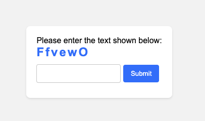
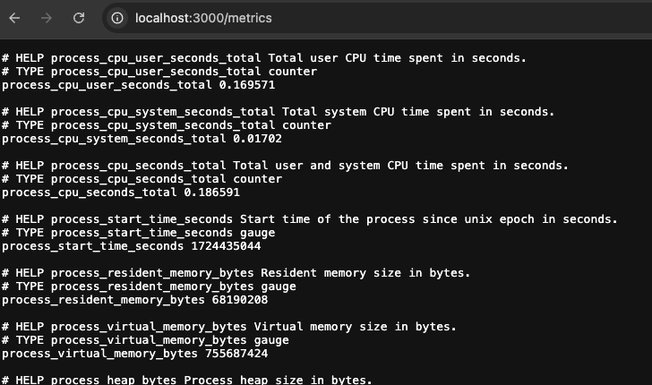
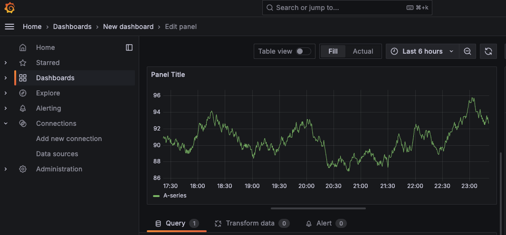
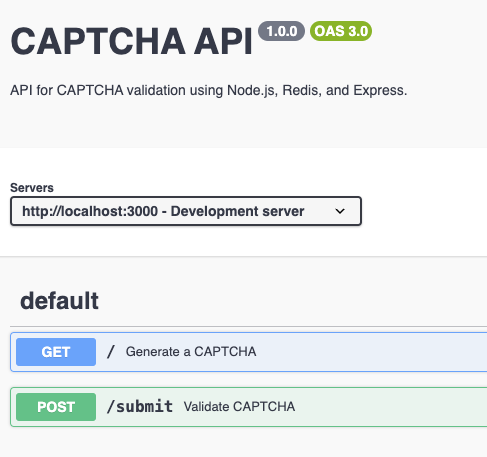

# Node.js CAPTCHA System with Redis, Prometheus, and Docker

## Overview



This project is a robust, scalable, and secure Node.js CAPTCHA system designed to run in a Dockerized environment. The application uses Redis for fast in-memory data storage, Prometheus for monitoring, and Grafana for visualization. It also includes several optimizations for performance, security, and scalability.

## Features

- **CAPTCHA System**: A simple CAPTCHA system implemented with Node.js and Redis.
- **Redis Integration**: Utilizes Redis for efficient data storage and retrieval.
- **Prometheus Monitoring**: Exposes application metrics for Prometheus to scrape.
- **Grafana Dashboard**: Visualizes metrics in Grafana.
- **Dockerized Environment**: Runs in a Dockerized environment with Docker Compose.
- **Cluster Mode**: Scales the application across multiple CPU cores.
- **Circuit Breaker**: Implements a circuit breaker pattern using `opossum` to handle Redis failures.
- **Rate Limiting and Throttling**: Protects the application from abuse using rate limiting.
- **Security Enhancements**: Implements security headers using Helmet and input validation using `express-validator`.

## Technologies Used

- **Node.js**: Backend framework for the CAPTCHA system.
- **Express**: Web framework for handling HTTP requests.
- **Redis**: In-memory data store for storing CAPTCHA data.
- **Prom-client**: Library for exposing Prometheus metrics from Node.js.
- **Docker**: Containerization platform for packaging the application.
- **Docker Compose**: Tool for defining and running multi-container Docker applications.
- **Prometheus**: Monitoring system to scrape metrics from the application.
- **Grafana**: Visualization tool for monitoring metrics from Prometheus.
- **Helmet**: Middleware for securing HTTP headers.
- **express-validator**: Middleware for input validation and sanitization.
- **opossum**: Circuit breaker library for Node.js.

## Setup and Installation

### Prerequisites

- Docker and Docker Compose installed on your system.
- Node.js and npm installed for local development.

### Installation Steps

1. **Clone the repository**:
    ```bash
    git clone <repository-url>
    cd <repository-directory>
    ```

2. **Install Node.js dependencies**:
    ```bash
    npm install
    ```

3. **Build and start the Docker containers**:
    ```bash
    docker-compose up --build
    ```

4. **Access the Application**:
    - **Node.js App**: `http://localhost:3000`
    - **Swagger Docs**: `http://localhost:3000/api-docs`
    - **Prometheus**: `http://localhost:9090`
    - **Grafana**: `http://localhost:3001`

### Prometheus, Grafana & Swagger


- **Prometheus Configuration**: The `prometheus.yml` file configures Prometheus to scrape metrics from the Node.js application.


- **Grafana Configuration**: Access Grafana at `http://localhost:3001`, add Prometheus as a data source, and create custom dashboards to visualize the metrics.


- **Swagger**: Access all the APIs related to Captcha on Swagger Docs - `http://localhost:3000/api-docs`

## Optimizations

- **Cluster Mode**: Utilizes Node.js's built-in `cluster` module to run the application across multiple CPU cores, improving scalability.
- **Circuit Breaker**: The circuit breaker pattern is implemented to prevent cascading failures when Redis is unavailable.
- **Rate Limiting**: Express rate limiting is configured to prevent abuse and ensure fair usage of the API.
- **Caching**: Redis is used for caching CAPTCHA data, significantly improving performance.
- **Dockerization**: The application is fully containerized using Docker and Docker Compose for consistent environments and easy deployment.

## Security

- **Helmet**: Applied to secure HTTP headers, preventing well-known web vulnerabilities.
- **Input Validation**: `express-validator` is used to sanitize and validate user inputs, protecting against injection attacks.
- **HTTPS**: It is recommended to run this application behind a reverse proxy like NGINX with SSL termination for HTTPS.

## Conclusion

This project demonstrates a fully Dockerized Node.js application with a focus on performance, security, and scalability. The integration of Redis, Prometheus, Grafana, and other tools ensures a robust solution for a production-grade CAPTCHA system.
